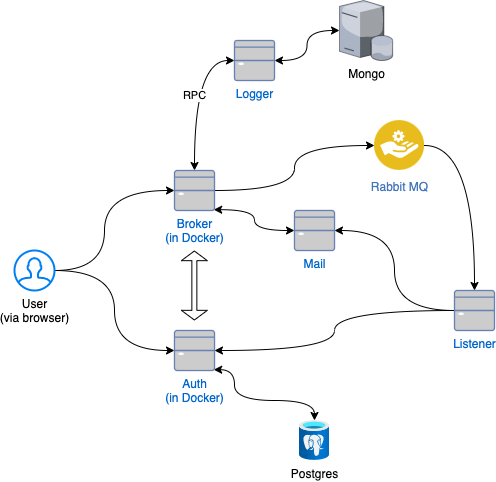

# Micro-app

# 1. What I'll build
- A frontend web application that connects to 5 Microservices:
- A broker: optional single point of entry to micro services
- Authentication service: Postgres
- Logger: MongoDB
- Mail: sends mail with a specific template
- Listener: consumes message from broker
